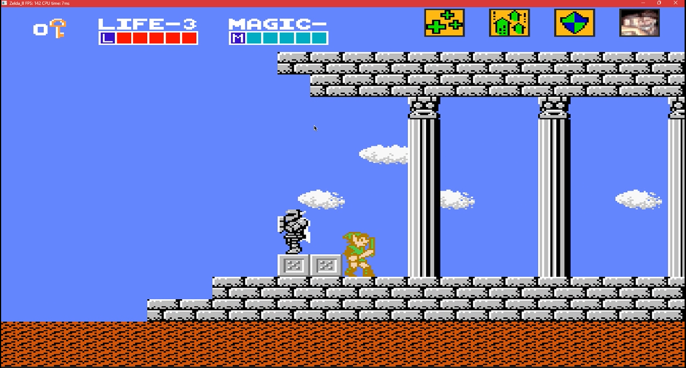
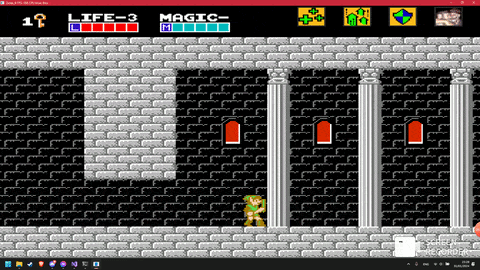
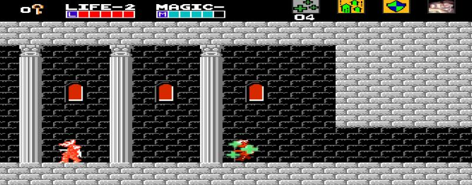
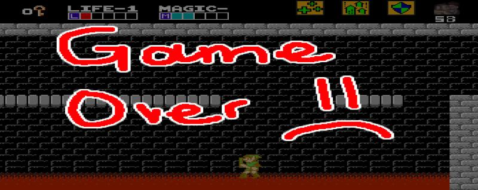

# HY454 Zelda II

<p align="center">
  
</p>

<p align="center">
  A C++20 side-scrolling action game inspired by <em>Zelda II: The Adventure of Link</em>, built together with a small custom engine, SDL2 rendering/audio, JSON-driven content, animated sprites, enemies, collectibles, spells, elevators, doors, and multi-stage tile maps.
</p>

<p align="center">
  <strong>ZeldaApplication</strong> is the game. <strong>ZeldaEngine</strong> is the reusable engine layer. <strong>ZeldaUnitests</strong> is a companion sandbox/test app.
</p>

## Gameplay

<p align="center">
  
</p>

Explore a tile-based palace level, fight enemies, collect keys and potions, ride elevators, open doors, cast spells, survive hazards, and push through staged sections of the map.

## Gallery

| Power-ups | Game over |
| --- | --- |
|  |  |

## Features

- Custom C++ game engine with an application/layer stack, event dispatching, timing, logging, rendering, animation, audio, and collision systems.
- SDL2 windowing, input, rendering, and audio integration.
- Tile map loading from JSON configuration and bitmap tilesets.
- Sprite animation films and frame/motion animators for Link, enemies, spells, overlays, doors, elevators, and collectibles.
- Gravity and grid-based collision filtering for platforming movement.
- Enemy roster including Bot, Wosu, Guma, and Staflos behavior.
- Collectibles including keys, potions, extra lives, and point bags.
- Four spells: Life, Jump, Shield, and Thunder.
- Pause, win, and game-over overlays.
- Premake-generated Visual Studio 2022 solution.

## Controls

| Key | Action |
| --- | --- |
| `A` | Move left |
| `D` | Move right |
| `S` | Crouch |
| `Q` | Attack, or crouch attack while crouched |
| `Space` | Jump |
| `1` | Cast Life spell |
| `2` | Cast Jump spell |
| `3` | Cast Shield spell |
| `4` | Cast Thunder spell |
| `Up` / `Down` | Move a selected elevator |
| `Esc` | Pause or resume |

## Tech Stack

- C++20
- Premake 5
- Visual Studio 2022
- SDL2
- OpenGL / Glad
- SDL-Music
- spdlog
- nlohmann/json

## Project Layout

```text
.
+-- ZeldaApplication/       # Main game code and runtime assets
|   +-- src/                # Link, enemies, layers, collectibles, spells
|   +-- Assets/             # Bitmaps, sounds, music, tile maps, JSON configs
+-- ZeldaEngine/            # Static engine library
|   +-- src/Engine/         # Application, renderer, audio, scene, events
|   +-- vendor/             # Engine dependencies and submodules
+-- ZeldaUnitests/          # Companion test/sandbox application
+-- projectScripts/         # Setup and project generation scripts
+-- vendor/premake5/        # Premake executable and customization
+-- Misc/                   # README media assets
+-- premake5.lua            # Workspace definition
```

## Getting Started

### Requirements

- Windows
- Visual Studio 2022 with C++ desktop development tools
- Git, for submodule initialization

### Generate the Solution

From the repository root:

```bat
projectScripts\setup.bat
```

This initializes submodules and runs Premake. To regenerate the Visual Studio files without updating submodules:

```bat
projectScripts\GenerateProject.bat
```

You can also run Premake directly:

```bat
vendor\premake5\binary\premake5.exe vs2022
```

### Build and Run

1. Open `HY454_Zelda_II.sln` in Visual Studio 2022.
2. Select `ZeldaApplication` as the startup project.
3. Build either `Debug|x64` or `Release|x64`.
4. Launch the game with `ZeldaApplication` as the working directory.

The game loads assets through paths such as `Assets/Config/...` and `Assets/AnimationFilms/...`, so the current working directory must be `ZeldaApplication/` when running.

## Content Configuration

Most gameplay content is data-driven through JSON files under `ZeldaApplication/Assets/Config/`, including:

- tile maps and tilesets
- animation frame definitions
- enemy spawn/configuration data
- collectible placement
- door, elevator, teleport, and stage data
- Link stats, enemy stats, power-up values, and spell costs

This makes it possible to tune the level and gameplay without touching most of the engine code.

## Engine Notes

`ZeldaEngine` is built as a static library and provides the core systems used by the game:

- application loop and layer stack
- window and input event handling
- renderer and bitmap helpers
- sprite, scene, tile, and grid systems
- frame, motion, scroll, path, and flash animation
- collision checking
- audio playback
- logging and assertions

`ZeldaApplication` composes these systems into the playable game through `Layer0`, `Layer1`, `Layer2`, and `Overlay`.

## Tests and Sandbox

`ZeldaUnitests` is included as a second console application linked against `ZeldaEngine`. It mirrors part of the application setup and can be used as a sandbox for engine/game experiments.

## License

This repository is licensed under the terms in [LICENSE](LICENSE).
